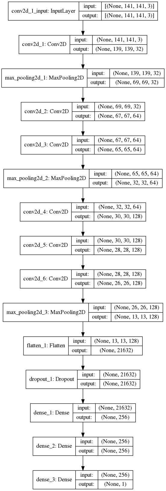

# Malaria cell detection with TensorFlow 2.0

### Introduction

A model originally written for a talk but as the meetup was delayed considerably, I'm open sourcing it.

In addition, the code was slightly modified to work with the new  Tensorflow 2.0.

The data-set is provided by the U.S National Library of Medicine. It consists of 27,558 images of individual
cells, 13779 infected and 13779 uninfected cells. The provided images come in various sizes, ranging from
90 x 90 pixels, all the way up to 320 x 240 pixels.

Special thanks to [Dr. Julian Rayner](https://www.sanger.ac.uk/people/directory/rayner-julian), who kindly shed a lot of light on the subject and cleared many doubts.

There is plenty of variation in the images and after close examination, there are cells infections from early to late
stages, where the cells become physically deformed.

### Installation

You should have two command line tools installed:

* wget
* unzip

I advise you to use a virtual environment. All the required packages can be found in requirements.txt or
requirements-gpu.txt. Alternatively you could use the setup.sh which should pick the right one for you.

**IMPORTANT NOTES**

TensorFlow 2.0 requires CUDA 10.0 and cuDNN 7.4.1. Installing those will break anything you have running with
TensorFlow 1.x. Use at your own risk.

**ONLY PYTHON 3.6+ IS SUPPORTED!**

I've become a big fan of the f-string syntax and I would like to avoid maintaining code that needs additional work for
it to run on older versions.

### Running the model

Once you've trained(or downloaded the pre-trained model), you can run it with:

```
$ python run.py --model=/path/to/model.h5 \
        --image=/path/to/directory/of/images/or/single/image
```

Use the `--help` flag for more options.

The JSON model description must be in the same directory as the pre-trained weights and having the same name as the
weights file with a json extension:

```
pretrained
├── model_2019-03-18T23:31:49.432520_0.9594166874885559_0.11796065587550401.h5
└── model_2019-03-18T23:31:49.432520_0.9594166874885559_0.11796065587550401.json
```

Use the `--help` flag to see more options.

### Model architecture



```
Model: "sequential_1"
_________________________________________________________________
Layer (type)                 Output Shape              Param #
=================================================================
conv2d_1 (Conv2D)            (None, 139, 139, 32)      896
_________________________________________________________________
max_pooling2d_1 (MaxPooling2 (None, 69, 69, 32)        0
_________________________________________________________________
conv2d_2 (Conv2D)            (None, 67, 67, 64)        18496
_________________________________________________________________
conv2d_3 (Conv2D)            (None, 65, 65, 64)        36928
_________________________________________________________________
max_pooling2d_2 (MaxPooling2 (None, 32, 32, 64)        0
_________________________________________________________________
conv2d_4 (Conv2D)            (None, 30, 30, 128)       73856
_________________________________________________________________
conv2d_5 (Conv2D)            (None, 28, 28, 128)       147584
_________________________________________________________________
conv2d_6 (Conv2D)            (None, 26, 26, 128)       147584
_________________________________________________________________
max_pooling2d_3 (MaxPooling2 (None, 13, 13, 128)       0
_________________________________________________________________
flatten_1 (Flatten)          (None, 21632)             0
_________________________________________________________________
dropout_1 (Dropout)          (None, 21632)             0
_________________________________________________________________
dense_1 (Dense)              (None, 256)               5538048
_________________________________________________________________
dense_2 (Dense)              (None, 256)               65792
_________________________________________________________________
dense_3 (Dense)              (None, 1)                 257
=================================================================
Total params: 6,029,441
Trainable params: 6,029,441
Non-trainable params: 0
_________________________________________________________________
```

A stripped down and simplified version of VGG16 with some tweaks and changes: Namely, binary
cross-entropy and Adam optimizer.

### Training

Downloading the data.
The data set is around just under 400MB compressed and can be downloaded through the shell script in the repository:

```
$ bash download.sh
```

If you want to train the model on your own, I would advise using a CUDA-powered GPU. The training on a CPU would take
several hours(6 to 8 give or take depending on your CPU). On a GPU (Gigabyte GeForce GTX 1080TI 11GB GDDR5X) the time
goes down to around 40 minutes.

You can tune the training parameters via the `config.yaml` file. **Before you start training, make sure you create the
directory defined under `output_models`. The training script will not do that for you.**

```
$ python train.py --config=config.yaml
```


### Pre-trained model.

The pre-trained model can be downloaded from [here](https://www.dropbox.com/s/0bw5u7a0q2oh57s/pretrained_model.zip)
**Training accuracy**

**Training loss**


**Sample resuls**

Random sample of uninfected cells, never used in the training:


**UPDATE**

I got a message from a user (who shall remain anonymous due to request) who trained the same network on a completely different dataset: The [Chest X-Ray Pneumonia dataset](http://academictorrents.com/details/7208a86910cc518ae8feaa9021bf7f8565b97644) and got similar results (over 90% accuracy) with just 1000 images per class. His parameters were set as follows:

```
batch_size: 60
epochs: 35
image_size: [150, 150]
labels: [NORMAL, PNEUMONIA]
output_models: models/
plot_training_data: true
random_state: 42
test_size: 0.3
train_images: chest_xray/train/
train_size: 1000
validation_steps: 15
steps_per_epoch: 60
```

The models he trained are available [here](https://www.dropbox.com/s/2e2au2osagkiu4t/pneumonia.zip).


Random sample of parasitized cells, never used in the training:

